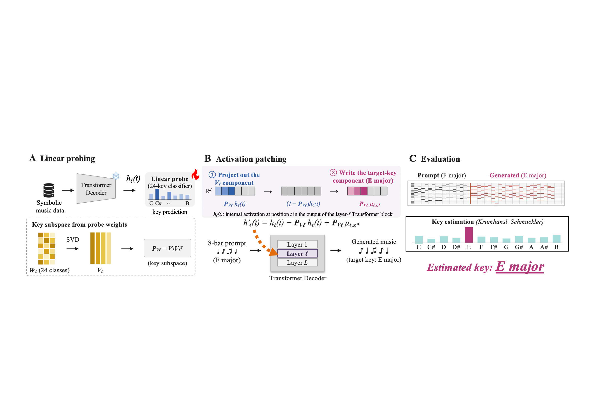

# Do Music Transformers Represent and Use Musical Key?

Code accompanying the manuscript by Genki Masuyama, Keigo Sakurai, Ren Togo,
Takahiro Ogawa, and Miki Haseyama (Hokkaido University).



Symbolic music Transformers can generate note sequences without ever receiving
explicit key, chord, or scale-degree tokens. This repository tests whether such
models nevertheless represent musical key internally, and whether replacing that
internal component changes generation.

We train GPT-2-style symbolic music models, fit linear probes to locate
key-related subspaces, and use activation patching to replace the prompt-key
component with the target-key component. The public release contains the main
experiment code, shared libraries, configuration files, and tests. It does not
include datasets, trained weights, computed results, manuscript sources, demos,
or additional-study artifacts.

---

## Updates

- Current manuscript mapping: Fig. 2 reports the main replacement effects,
  Fig. 3 reports the main layerwise comparison, and Table 1 reports public-model
  results.
- The default branch is a code-release branch. Re-running full experiments
  requires external corpora, public checkpoints, and a CUDA GPU.
- The smoke test is CPU-friendly and checks the end-to-end mechanics on a tiny
  temporary synthetic run.

---

## Installation

Use Python 3.12 and run commands from this directory. For synthetic experiments
only, `requirements.txt` is sufficient. Public-model runs need
`requirements-public.txt`; development checks use `requirements-dev.txt` with the
tested constraints in `requirements-tested.txt`.

### TL;DR

```bash
git clone https://github.com/masuyama-genki-eng/music-key-patching.git
cd music-key-patching

python3.12 -m venv .venv
source .venv/bin/activate
python -m pip install -r requirements-dev.txt -c requirements-tested.txt

python -m pytest tests -q
python scripts/smoke_test.py
```

The smoke test creates temporary synthetic pieces, trains a small decoder for two
steps, reloads its checkpoint, and checks activation capture, patching, and
seeded generation. Temporary files are removed afterward.

---

## Repository Layout

| Path | Purpose |
|---|---|
| `src/` | Library code: tokenization, data generation, models, probes, patching, evaluation, public-model adapters |
| `experiments/` | Reproducible entry points for training, probing, patching, public models, and reanalyses |
| `configs/` | Seeds, corpus settings, tokenizer settings, probe settings, and model settings |
| `tests/` | Regression tests and smoke checks |
| `scripts/` | Utility scripts such as corpus fetching and the smoke test |

Generated files are written under `data/` and `results/`; those directories are
not distributed with this code release.

---

## Important Entry Points

### Synthetic corpus and main models

The synthetic pipeline generates the training and analysis corpora, trains six
main models, and runs a quality gate before probing or patching.

```bash
python experiments/data_and_models/generate_corpus.py
python experiments/data_and_models/train_models.py
python experiments/data_and_models/quality_gate.py
```

The six main models are the two augmentation regimes, with and without
transposition to all keys, crossed with seeds 0, 1, and 2. The manuscript's main
model is the augmented seed-0 run.

### Linear probing

Linear probes estimate where key information is readable from each layer. The
note-history baseline tests whether the same information can be explained by
recent pitch-class counts.

```bash
python experiments/probing/probe_key.py --model-dir results/models/R-Aug_s0
python experiments/probing/window_matched_baseline.py \
  --model-dir results/models/R-Aug_s0 --probing-dir results/probing/R-Aug_s0
```

### Target-key replacement

These scripts calibrate the likelihood guard, search layers on held-out prompts,
and run the final continuation and before-sampling tests.

```bash
python experiments/editing/freeze_quality_guard.py
python experiments/editing/edit_sweep.py --model-dir results/models/R-Aug_s0
python experiments/editing/layer_profile.py

for mode in major minor; do
  python experiments/confirmatory/confirmatory_test.py --mode "$mode"
  python experiments/confirmatory/next_pitch_test.py --mode "$mode"
done
```

Additional robustness checks are available in `confirmatory/k4_ceiling.py`,
`reanalysis/threshold_sensitivity.py`, and `experiments/steering/`.

### Pitch-class controls

The pitch-class control tests whether replacement works only through a linear
encoding of recent pitch-class frequency.

```bash
python experiments/reanalysis/pitchclass_subspace.py --stage fit
python experiments/reanalysis/pitchclass_edit.py --mode major
python experiments/reanalysis/pitchclass_edit.py --mode minor
```

### Public-model experiments

The public-model pipeline supports Anticipatory Music Transformer checkpoints,
MMT, and the REMI-representation baseline released with MMT.

```bash
python experiments/public_models/public_probe.py \
  --adapter anticipatory --model stanford-crfm/music-small-800k --corpus bach
python experiments/public_models/public_quality_guard.py \
  --adapter anticipatory --target-model stanford-crfm/music-small-800k \
  --ref-adapter anticipatory --ref-model stanford-crfm/music-medium-800k --corpus bach
python experiments/public_models/public_edit_sweep.py \
  --adapter anticipatory --model stanford-crfm/music-small-800k \
  --ref-adapter anticipatory --ref-model stanford-crfm/music-medium-800k \
  --corpus bach --stage 1
```

Balanced public-model cells re-estimate the probe and target-key means at the
selected layer before the final edit stage:

```bash
python experiments/public_models/public_balanced_probe.py \
  --adapter anticipatory --model stanford-crfm/music-small-800k --corpus bach --layer 8
python experiments/public_models/public_edit_sweep.py \
  --adapter anticipatory --model stanford-crfm/music-small-800k \
  --ref-adapter anticipatory --ref-model stanford-crfm/music-medium-800k \
  --corpus bach --stage 2 \
  --artifacts-dir results/mwild/music-small-800k/balanced --tag _balanced
```

### Public before-sampling comparison

```bash
python experiments/reanalysis/public_next_pitch.py \
  --adapter anticipatory --model stanford-crfm/music-small-800k --layer 8 \
  --outdir results/reanalysis/a11/music-small-800k
```

---

## Data and Checkpoints

```bash
python scripts/fetch_data.py --corpus bach analyses pop909
```

The helper fetches upstream corpora and records source revisions in
`data/sources.json`. Existing checkouts are preserved.

| Resource | Source | Local directory |
|---|---|---|
| Bach scores | `craigsapp/bach-370-chorales` | `data/bach-370-chorales/kern/` |
| Key annotations | `MarkGotham/When-in-Rome` | `data/When-in-Rome/` |
| Pop scores and labels | `POP909-CL` | `data/POP909-CL/POP909_processed/` |

AMT checkpoints are loaded from Hugging Face:

- `stanford-crfm/music-small-800k`
- `stanford-crfm/music-medium-800k`
- `stanford-crfm/music-large-800k`

For MMT and REMI+, obtain the archive linked in the MMT pretrained-model
instructions and extract it so these files exist:

```text
data/mmt-checkpoints/mmt/lmd/ape/train-args.json
data/mmt-checkpoints/mmt/lmd/ape/checkpoints/best_model.pt
data/mmt-checkpoints/mmt/lmd/remi/train-args.json
data/mmt-checkpoints/mmt/lmd/remi/checkpoints/best_model.pt
```

Check the archive with:

```bash
python experiments/public_models/verify_mmt_checkpoint.py
```

Dataset and checkpoint licenses are separate from this repository's code
license.

---

## Outputs

Runs write artifacts under `results/`. Use a fresh results directory for a new
protocol, because some scripts reuse completed artifacts or refuse to overwrite
frozen settings. Metadata records `NO_GIT` when the working tree is not inside a
git checkout.

---

## Citing & Authors

If you use this repository, please cite the accompanying manuscript. A BibTeX
entry will be added after publication.

Authors: Genki Masuyama, Keigo Sakurai, Ren Togo, Takahiro Ogawa, and Miki
Haseyama.

---

## License

The code is released under the [MIT license](LICENSE). Vendored-code attribution
is listed in [THIRD_PARTY_NOTICES.md](THIRD_PARTY_NOTICES.md).
